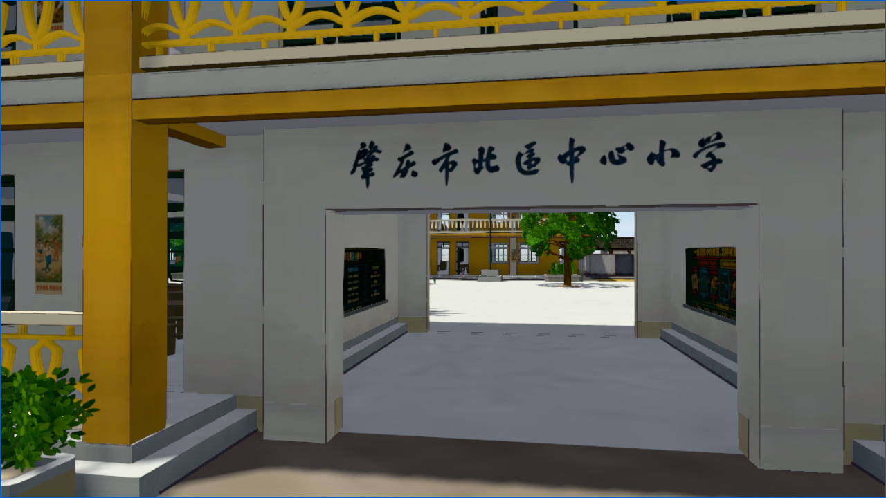
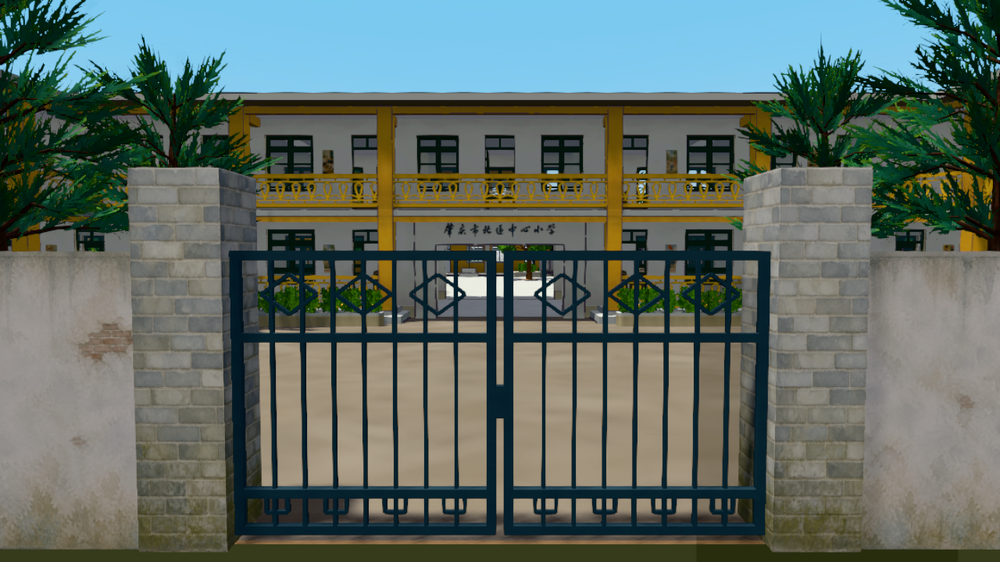
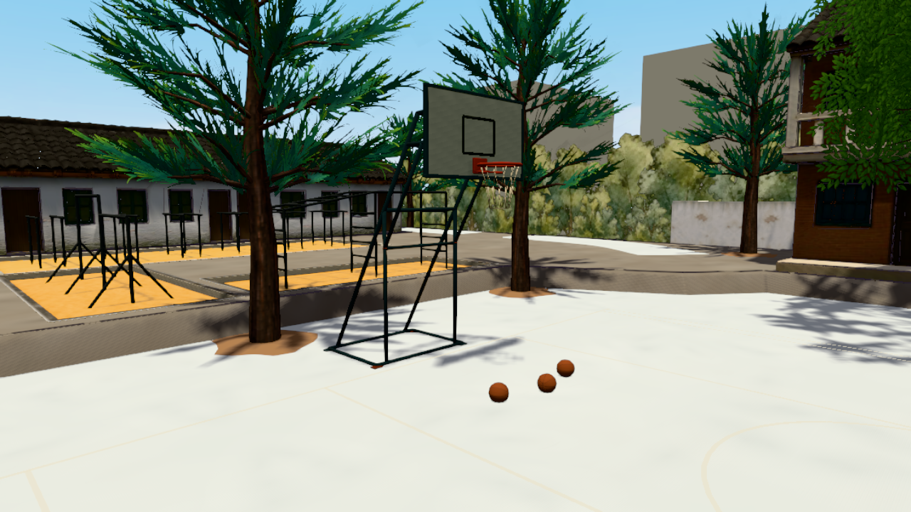
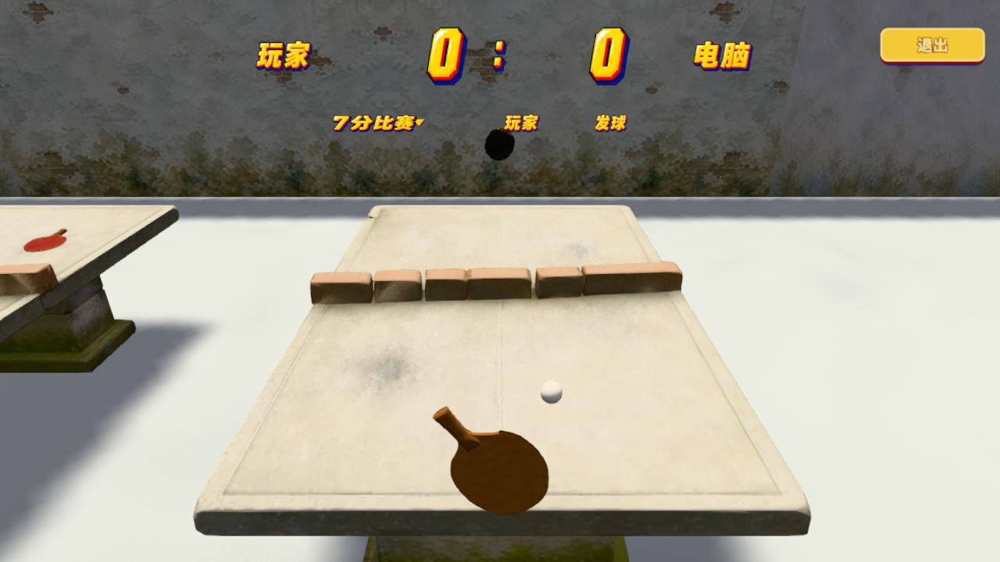
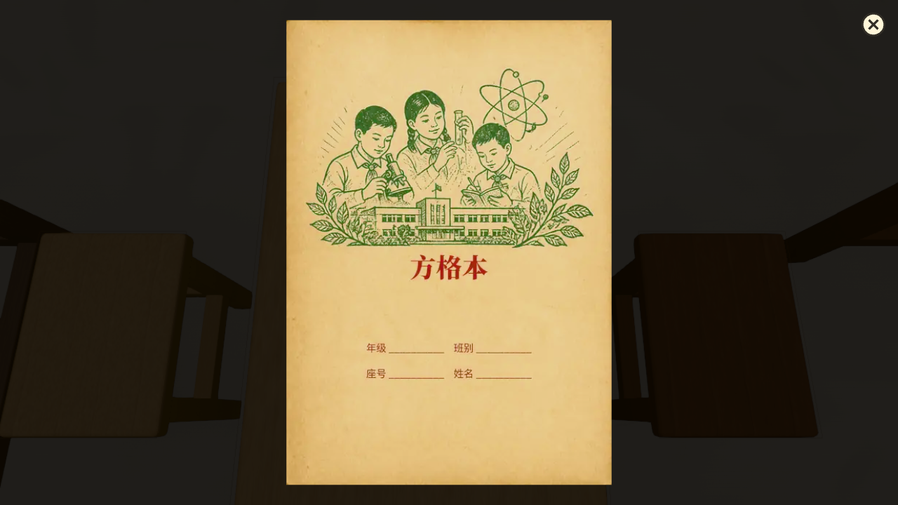
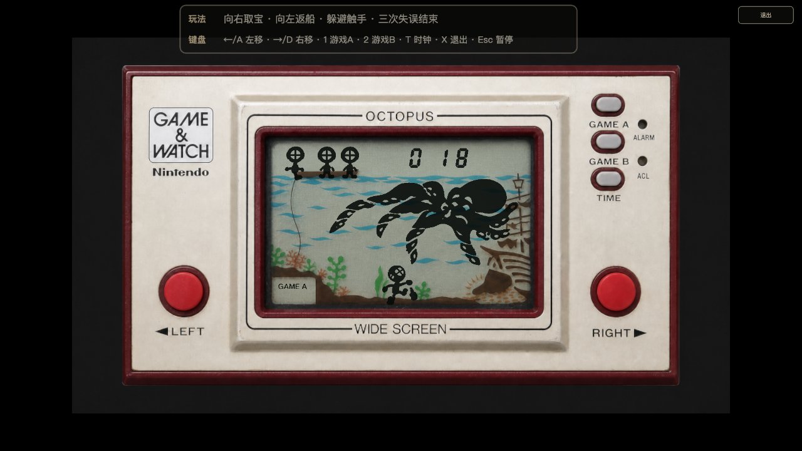
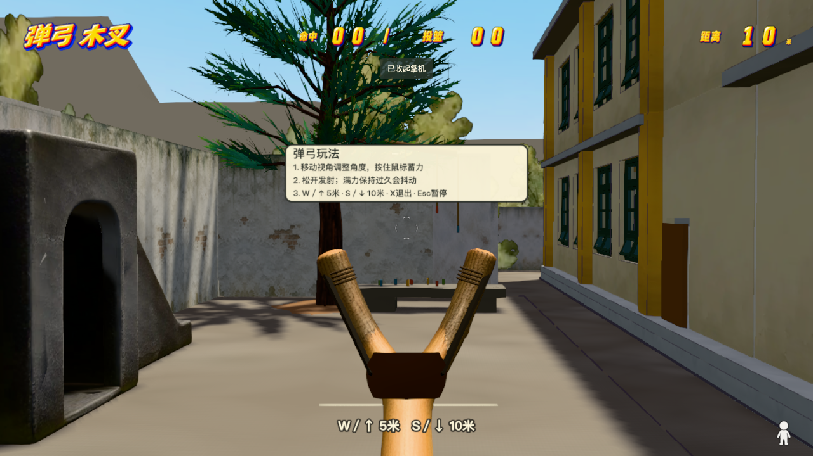

<p align="center">
  
</p>

# 4Lite

[English](README.md) · [简体中文](README.zh-CN.md)

[](https://github.com/smartdio/4lite/actions/workflows/public-build.yml)

4Lite is an interactive first-person 3D memory project built with Three.js. It reconstructs a primary school in Guangdong, China, as it was remembered in the early 1980s, using first-hand recollections, hand-drawn plans, historical photographs, and carefully marked dimensional estimates.

**Live experience:** [4lite.vercel.app](https://4lite.vercel.app)

> **Open-source repository note**
>
> This repository is an installable and buildable MIT-licensed open-source code snapshot, not the complete playable distribution. The full campus models, environment audio, music, textures, and some interaction assets are intentionally excluded. A local build of this repository therefore cannot reproduce every scene or game shown below. The live experience continues to use the complete private asset set.



## The experience

4Lite is designed as a place to revisit rather than a conventional level-based game. Players can walk through the school gate, explore the courtyard and teaching buildings, enter classrooms, examine period objects, sit down, draw on blackboards, and discover small pieces of school life.

The reconstruction does not present uncertain details as measured fact. Confirmed memories and source material take priority; dimensions and details that remain uncertain are treated as working values.

## How it was made

The campus was built through repeated exchanges between memory and implementation: first-hand recollections, sketches, and historical photographs were organised and assigned confidence levels; spatial relationships were then translated into measured plans and walkable Three.js grayboxes for review. Once the layout was confirmed, the project moved through visual development, asset production, interaction design, mobile adaptation, performance profiling, and regression testing, with uncertain details kept as working values until new evidence or first-hand review resolved them.

Read the chaptered web edition of [From Memory to Campus: The Making of *The School I Remember*](https://4lite.vercel.app/stories/from-memory-to-campus/en/), or read the [source essay](docs/project-development-story.en.md) in the repository. The story now includes the slingshot, later playground games, the *Fire* handheld, flag raising, and the personal record book.

## Games and interactions

The complete experience includes:

- **Basketball** — pick up the ball, aim and control shot strength, then score two, three, or four points according to the release position. Successful shots use a layered 1980s arcade-comic HUD.
- **Table tennis** — choose practice or a seven-point match, serve from the selected paddle position, rally against the AI, and control the paddle with mouse or touch input.
- **Long jump** — time the take-off direction and power, land in the sandpit, and leave a measured result marker behind.
- **Bamboo-pole climbing** — alternate hand movements, manage charge timing, and climb or slide down the paired poles.
- **Hopscotch** — throw the tile into hand-drawn eight- and nine-cell layouts, complete the outbound and return route, and respect line and foot-placement rules.
- **Shuttlecock kicking** — alternate feet, reposition beneath the shuttlecock, and build a best streak without letting it land.
- **Jacks** — toss the king piece, gather one, two, and three stones through successive stages, and catch it before time runs out.
- **Slingshot practice** — choose a wooden or wire slingshot, fire clay pellets from five- and ten-metre lines, and hit hanging targets with different power and stability characteristics.
- **Flag raising** — grip and pull the rope repeatedly to raise the flag, with progress preserved while the interaction remains active.
- **Classroom memories** — draw with chalk, open school books and compositions, inspect pencil boxes and snack bags, handle a Rubik's Cube, and play two period-inspired LCD handheld games.

### Gameplay screenshots

| Campus entrance | Courtyard exploration |
| --- | --- |
|  |  |

| Basketball | Table tennis |
| --- | --- |
|  |  |

| Open textbook | Comic-book viewer |
| --- | --- |
|  |  |

| LCD handheld game | Slingshot aiming |
| --- | --- |
|  |  |

## Controls and platforms

- Desktop exploration supports keyboard movement, mouse look, point-to-walk navigation, and contextual interaction.
- Mobile and tablet layouts use dedicated touch walking, looking, and game controls.
- Minigames share consistent pause and exit rules: `Esc` pauses on desktop, while `X` or the pause menu returns to the campus where applicable.
- Visible in-campus HUDs and game controls are rendered with WebGL/Three.js rather than modern HTML overlays.

## Technology

- Three.js and WebGL for the campus, interactions, and HUDs
- Vite for development and production builds
- Node.js test runner for deterministic gameplay units
- Playwright for complete local interaction, rendering, mobile, and performance coverage
- Asset budgets and repository-boundary checks enforced by scripts and GitHub Actions

## Build the public snapshot

Node.js 22 and npm are required.

```bash
npm ci
npm run test:unit
npm run verify:public
npm run build
```

`npm run build` verifies that the public source snapshot can be bundled. It does not restore the private runtime assets, and the resulting build is not a complete playable release.

## Validate the complete local project

The full private-asset workspace can run:

```bash
npm run test:performance:full
```

This command runs the production build, build-performance budgets, the test build, and the complete Playwright suite. Asset-dependent Playwright tests are intentionally not run in public GitHub Actions.

## Open-source boundary and licensing

- Software code is available under the [MIT License](LICENSE).
- Original articles and written documentation distributed in the public repository use [CC BY 4.0](CONTENT_LICENSE.md).
- See [ASSET_LICENSES.md](ASSET_LICENSES.md) for the source, licence, and exclusion status of public media assets.
- Third-party assets retain their own licences and are not covered by the project code licence.
- Assets without confirmed public redistribution rights are excluded by default and checked by `npm run verify:public`.
